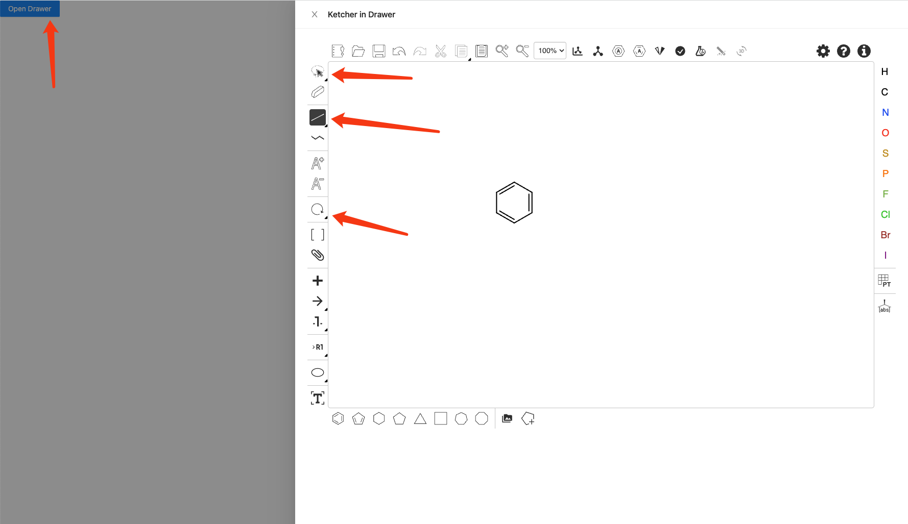
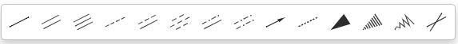
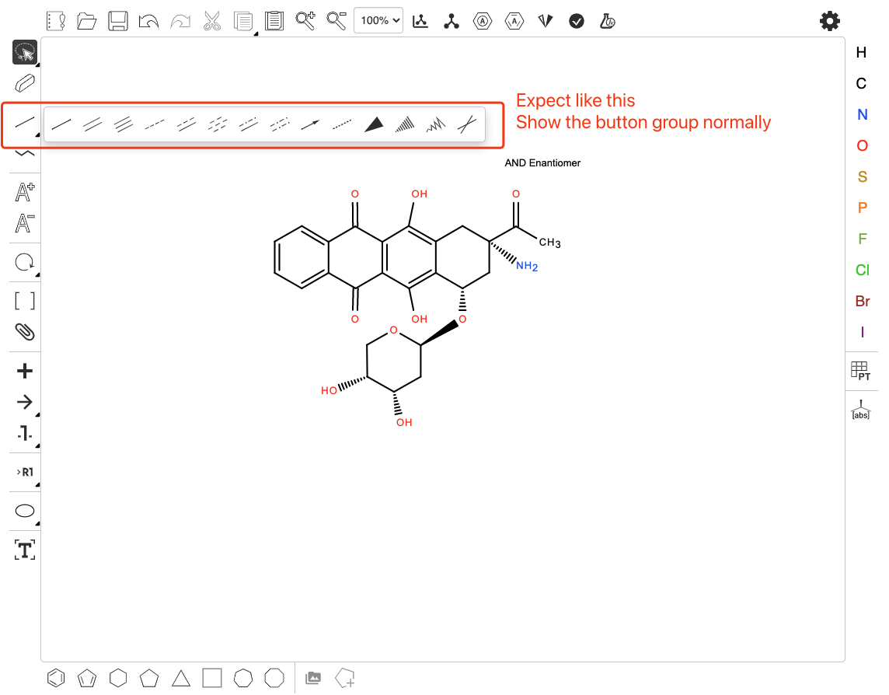

# Issue

When I Click the button `Open Drawer` to open a drawer, we could see Ketcher in the Drawer.

However, the button group `could not be presented` when we click some buttons, such as `select`/`bonds`/`transforms`.

- Click `bonds` button

- Button group bar is lost

# Expect

- Expect show the button groups normally as below.

# How to reproduce the issue

- Install packages with `yarn`
- Then `yarn start`
